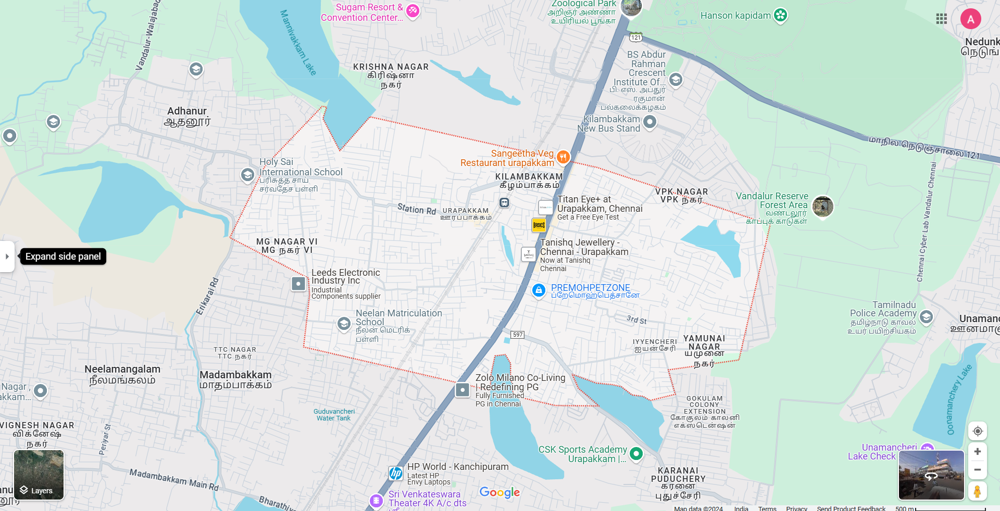

# Ex04 Places Around Me
## Date: 06.12.2024

## AIM
To develop a website to display details about the places around my house.

## DESIGN STEPS

### STEP 1
Create a Django admin interface.

### STEP 2
Download your city map from Google.

### STEP 3
Using ```<map>``` tag name the map.

### STEP 4
Create clickable regions in the image using ```<area>``` tag.

### STEP 5
Write HTML programs for all the regions identified.

### STEP 6
Execute the programs and publish them.

## CODE
```
map.html

<html>
<head>
<title>My City</title>
</head>
<body>
<h1 align="center">
<font color="green"><b>Urapakkam</b></font>
</h1>
<h3 align="center">
<font color="blue"><b>Avantika Krishnadas Kundooly (24001601)</b></font>
</h3>
<center>




<map name="image-map">
    <area target="" alt="Neelan School" title="Neelan School" href="neelan.html" coords="633,569,868,695" shape="rect">
    <area target="" alt="Sangeetha Restaurant" title="Sangeetha Restaurant" href="Sang.html" coords="841,261,1105,330" shape="rect">
    <area target="" alt="Titan Eye shop" title="Titan Eye shop" href="titan.html" coords="1030,372,1260,435" shape="rect">
    <area target="" alt="Tanishq Jewellery" title="Tanishq Jewellery" href="tan.html" coords="979,522,1244,450" shape="rect">
    <area target="" alt="Premohpetzone" title="Premohpetzone" href="pet.html" coords="992,537,1256,603" shape="rect">
</map>
</center>
</body>
</html>

neelan.html

<html>
<head>
<title>My Home Town</title>
</head>
<body bgcolor="yellow">
<h1 align="center">
<font color="blue"><b>Urapakkam<b></font>
</h1>
<h3 align="center">
<font color="red"><b>Neelan School</b></font>
</h3>
<hr size="3" color="black">
<p align="justify">
<font face="Georgia" size="5">
Neelan Matriculation Higher Secondary School in Urapakkam, Chennai, is a well-regarded educational institution offering quality education from kindergarten to higher secondary levels. Known for its focus on academic excellence, holistic development, and extracurricular activities, the school provides a nurturing environment with dedicated faculty and modern facilities to support students' growth.</font>
</p>
</body>
</html>

sang.html

<html>
<head>
<title>My Home Town</title>
</head>
<body bgcolor="pink">
<h1 align="center">
<font color="blue"><b>Urapakkam<b></font>
</h1>
<h3 align="center">
<font color="red"><b>Sangeetha Restaurant</b></font>
</h3>
<hr size="3" color="black">
<p align="justify">
<font face="Georgia" size="5">
Sangeetha Veg Restaurant in Urapakkam, Chennai, is a popular vegetarian dining spot offering a range of South Indian, North Indian, Chettinad, and Chinese cuisines. Known for its quality food, efficient service, and welcoming ambiance, it caters to dine-in, takeaway, and delivery. It also features a party hall for events and gatherings.A pleasant atmosphere with attentive staff and efficient service. It has a seating capacity of 86 and is equipped with air-conditioned dining areas.</font>
</p>
</body>
</html>

tan.html

<html>
<head>
<title>My Home Town</title>
</head>
<body bgcolor="pink">
<h1 align="center">
<font color="yelow"><b>Urapakkam<b></font>
</h1>
<h3 align="center">
<font color="red"><b>Tanishq Jewellary</b></font>
</h3>
<hr size="3" color="black">
<p align="justify">
<font face="Georgia" size="5">
Tanishq Jewellery in Urapakkam is a renowned store offering a wide range of gold, diamond, and platinum jewellery, renowned for its unique designs and exceptional craftsmanship. The store provides an array of collections, including traditional, contemporary, and wedding pieces, ensuring high-quality products that meet customers' preferences. With a reputation for transparent pricing, customer satisfaction, and exquisite detailing, Tanishq has become a trusted name in jewellery retail. The showroom offers a pleasant shopping experience, with a focus on trust and authenticity, making it a go-to destination for those seeking elegant and timeless pieces.</font>
</p>
</body>
</html>

titan.html

<html>
<head>
<title>My Home Town</title>
</head>
<body bgcolor="purple">
<h1 align="center">
<font color="green"><b>Urapakkam<b></font>
</h1>
<h3 align="center">
<font color="red"><b>Titan Eye shop</b></font>
</h3>
<hr size="3" color="black">
<p align="justify">
<font face="Georgia" size="5">
Titan Eye+ in Urapakkam is a trusted destination for eyewear and eye care solutions. The store offers an extensive collection of stylish eyeglasses, premium lenses, branded sunglasses, and contact lenses. With advanced eye-testing facilities and a team of skilled optometrists, Titan Eye+ ensures accurate prescriptions and personalized service. Customers can explore eyewear from leading brands and enjoy the perfect blend of style, quality, and comfort. The shop also provides repair services, convenient payment options, and attractive offers, making it a preferred choice for eye care in the area.</font>
</p>
</body>
</html>

pet.html

<html>
<head>
<title>My Home Town</title>
</head>
<body bgcolor="red">
<h1 align="center">
<font color="brown"><b>Urapakkam<b></font>
</h1>
<h3 align="center">
<font color="white"><b>Premoh Pet Zone</b></font>
</h3>
<hr size="3" color="black">
<p align="justify">
<font face="Georgia" size="5">
Premoh Petzone is a pet care center in Urapakkam that offers services such as grooming, pet supplies, and boarding facilities. It caters to pet owners' needs, ensuring a safe and comfortable environment for pets. it provides a variety of pets from parrots to bunnies. premoh aims to find a loving home for all the pets that needs to be taken care of. they also accept strays and are willing to care for it.</font>
</p>
</body>
</html>


```

## OUTPUT

-1.png>)
-1.png>)
-1.png>)
-1.png>)
-1.png>)


## RESULT
The program for implementing image maps using HTML is executed successfully.
